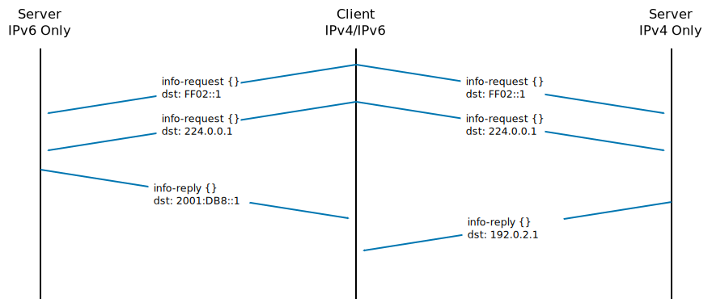
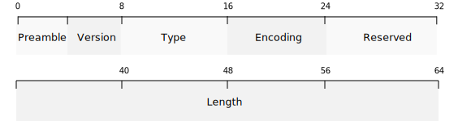
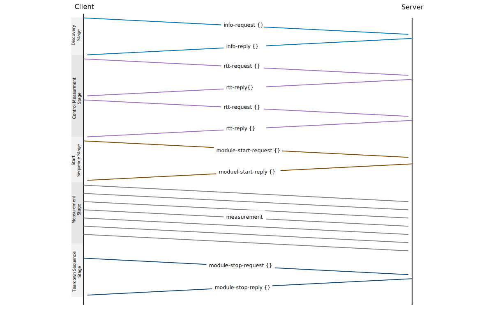

# Maparo

## Abstract

> *Esperanto for Atlas*

Maparo is a network performance measurement protocol specification. Beside
iperf, netperf and other tools it just defines the protocol
specification - not one particular implementation. Similar to HTTP/2 (RFC 7540) or any
other networking protocol specification.

Maparo differentiate between the control protocol (e.g. probe the server or
start measurement) and the measurement protocol (e.g. tcp stream with sequence
numbers). The later specification is done in separate module specification.

Maparo was designed to be flexible and extensible. Maparo differentiate
between the control protocol and the measurement protocol.  The control
protocol is keep as simple as possible and provides a basis functionality like
service discovery, measurement start request and so on. It provides the
transport layer for the module specific measurement protocol. The actual workhorses are
implemented in so called "maparo modules", they implement the building blocks
for measurements. Some of them are mandatory, many are optional and it is also
possible to develop completely proprietary modules.

There is one reference implementation: mapago (implemented in go, thus the
name). A Python implementation is also available (but protocol support is based
on older version of maparo). But you can - and should - program your own
implementation in your language of choice. No matter if it is GUI or command
line interface tool.

**KEEP IN MIND:** maparo protocol is not finalized yet. We do our best not to
change the existing specification, but we cannot rule it out.

## Introduction

### Modules

Modules can be mandatory or optional. Modules itself can require mandatory
feature set and provide an optional feature set.

- Mandatory Modules
- Optional Modules
- Unofficial Modules

#### Mandatory Modules

Mandatory module feature functionality MUST be able to implemented at any
platform. Operating system specific features MUST NOT be required in a
Mandatory Module.

Mandatory modules have a short name, words are separated by dash. E.g.
`tcp-goodput`.

#### Optional Modules

Blessed and officially released modules. Implementation can implement these
modules if they want. If Optional Modules are implemented they MUST follow the
specification.

Optional modules have a short name, words are separated by dash. E.g.
`tcp-tls-goodput`.

#### Unofficial Modules

Possibility to implement proprietary modules. Proprietary modules MUST start with
a underscore (e.g. `_avian-test-protocol`). But unofficial modules SHOULD use a
more unique name to avoid naming clashes: `_com-protocollabs-avian-test-protocol`.

### Time Format

All internally measured and transferred timevalue should use a realtime clock
(`CLOCK_REALTIME`). `CLOCK_MONOTONIC` principle be used if a clean synchronization
between client and server can de done. This is principle be true for remote mode.
But because the time synchronization is a) not that accurate as required and b) not
possible at all if operated in a non-remote mode.

The only solution is to ignore this within maparo. If a high resolution timing
analysis between client and server is required the only solution is to use GPS/PTP
for the time of measurement.

`CLOCK_MONOTONIC_RAW` would be fine if we can build upon maparo internal time
synchronization mechanisms - but we can't.

#### Exchanged Time Format

If time is exchanged via JSON the format MUST be UTC. The time resultion should
be in nanoseconds:

```
2017-12-16T12:32:42.763987000
```

Implementations SHOULD check the number of digits of the fractions. If the number
is six then microseconds is used. If 9 digits it should be interpreted as nanoseconds.

With Python3:

```python
import datetime
dt = datetime.datetime.utcnow()
print(dt.strftime('%Y-%m-%dT%H:%M:%S.%f'))
```

For Golang:

```go
import "time"
import "fmt"
t = time.Now().UTC()
fmt.Println(t.Format("2006-01-02T15:04:05.000000000"))
```

and reverse

```go
ret, err := time.Parse("2006-01-02T15:04:05.000000000" , t)
if err != nil {
	// do what you want
}
```

### Payload Pattern

Maparo pre-defines several payload pattern to be
used in modules.

The pattern is true for one "chunk". One chunk is one pre allocated buffer and
is typically one UDP packet or one large TCP chunk. Chunks are reused and
pattern are not recalculated (thus identical). This is for performance aspects
because randomizing and touching chunks are CPU intensive and may lower the
network performance. I don't see any network measurement advantageous where
recalculating is required. Often optimizer and gzip for UDP work on a packet
level and for TCP the chunk size can be quite large so there is no real problem
with this limitation.

#### Zero

Just 0 for the complete payload

Name: `zero`

#### Random ASCII (letter)

Randomized string with `a-zA-Z0-9`. No Unicode

Name: `random-ascii`

#### Random 

Random is a pure random byte generator.  The generator tries to use the most
cryptographic random bytes from the underlying operating system (e.g.
`/dev/random` seed combined with AES)

Name: `random`


## Control Protocol

### Essential Characteristics

Each server - started with argument `remote` listening on a TCP _and_ UDP port
for incoming control messages. The control protocol is fully optional, each
operation must be possible without a control protocol, though the program
arguments must be set manually and the result set must be merged manually by
using USB stick or some other transfer method.

The default control port for TCP and UDP is 64321. The control port can be
adjusted to any other port. The control *should* listen to unicast and
multicast and bind to the wildcard address. Supporting IPv4 and IPv6. The
network protocol *should* be selectable to disable IPv4/IPv6 if required.


To protect public servers the control must support a secret mechanism. It
is intended not a cryptographic mechanism because multicast and cryptographic
is somehow hard to do. Also for unicast encryption with a TLS like mechanism
certificates must be setup which is not always possible and increase the
complexity. Maparo is a control application and used in walled environments.
The secret mechanism is comparable to SNMPv1 with the community string - not
more.

The server must response to each message - unique identified by the sequence
number - exactly once. The server MUST NOT response multiple times to one
sequence number. The client MUST NOT reuse the same sequence number again, the
sequence number must always be incremented by the client at each transmission.

> To increase robustness for lossy links the client may send several requests
> with increasing sequence number. The server *should* drop packets with already
> processed sequence numbers.

The sequence number serves as a duplicate and reobustness method within the control
packet sequence. To differentiate two ongoing, parallel measurements the
sequence number is not suffiently. To identify a measurment uniquely a "measurment-id"
is required.

> Use case: one client, one server setup. The server start with one UDP goodput
> measurement and one TCP goodput measurement in parallel. To get info from one
> particular module the client must identify the particular measurement. The
> identification of the module like "udp-goodput" is not sufficiently because
> two udp-goodput modules may operates on the same time. Therefor a 'measurment-id'
> was introduced.

The Control Protocol is optional. All implementations are engaged to implement
a mechanism on server and client side to use the same functionality without
the protocol requirements.

The control protocol is designed to work on top of UDP and TCP. Additional
for UDP the protocol is also designed from the ground up to operate via Multicast.

UDP for discovery is fine, but for control communication a client/server should
prefer TCP for reliable communication - if any possible. Normally a UDP based
communication for standard request/reply flow is fine, at least when collected
data must be transfered back from server to client at measurement stop and if
the collected data is larger as MTU sized packets a reliable control channel is
required. This can be done with UDP and implement all the fancy stuff, at the
and what is implemented looks like TCP - why not take TCP for all control activity?

If TCP is selected as control protocol the control connection SHOULD stay open
all the time. This is required to allow the server to send asynchonous messages
during the measurement. This is required for modules inmplementing a reverse
transmission (data transmission from server to client) and inform the client when
finished. The client cannot know this and may poll the server otherwise. Thus,
it is helpful when the TCP control connection stays open during the complete
measurment.

### Golden Rule of Operation

The Control Protocol MUST never influence the measurement in any way. For
example: during a TCP measurement the control protocol must absolutely
do nothing - no transmission at all. This is especially important if
test are done in environments with only several kb bandwidth.

The only exceptions are explicit switches where the user is explicitly
informed that control traffic is not send over the wire. Use cases where
permanent protocol exchange is required are progress bars where status
(transferred bytes) are updated live at client side, without waiting
until the transmission is ready.

### Unicast

For Unicast measurments the control protocol SHOULD use TCP - even if the
measurement protocol is UDP. If exact round trip time measurements are required,
the TCP timeouts has negative impact or if UDP has other advantages compared to
TCP, UDP can be used as the control protocol. Though, packet loss, reordering
must be handled by the control plane.

### Multicast

If a remote server receives a UDP multicast request, the reply must be a UDP
unicast.  The unicast reply must address the sending IPv{4,6} address.

It is possible that after a certain discovery phase (most likely INFO-REQUEST,
INFO-REPLY) and the "most wanted" server is selected the addressing change
from multicast to unicast adressing.

> There is no need to send Time Diff request/reply probes to an multicast address
> and filter the results later if several servers are within the multicast
> domain.

### Control Address and Data Address

Beside iperf and other performance measurement programs maparo splits
control and data channel for maximum flexibility. Most often the control
and data channels are routed over the same protocol and path. Sometimes
the setup requires something special. Imagine a network with loss of
50%, a TCP control channel will not work in such environments. To analyse
such networks it is required to provide two networks: a test network and
a control network. To support such environments maparo must differentiate
control and data plane.

> Example: **Maparo Pulser**
>
> Two options are available
> - addr
> - ctrl-addr
>
> If no addr is given (None), the addr can be derived from info-reply
> message originator addresses. This is an implementation detail.

If it is a multicast measurement the addr must be given. The ctrl-addr
must be a multicast address to. It SHOULD be the identical multicast address.

To discover maparo servers the ctrl address can be a multicast addresses.
To discover both IPv4 and IPv6 only hosts the control address can be a list.
E.g. `--ctrl-addr FF02::1,224.0.0.1`

If a data address is given the address has precedence and MUST overwrite
the control address if the control address is a multicast address. If the
control address is a unicast address both addresses MUST be untouched.

If no control address given (None) the application SHOULD take the data
address.

> This is the standard behavior and is what the user expect! In 90% of
> all use cases the measurment and control network is identical. The user
> should not be enforced to specify the same address for unicast and
> multicast twice.

If no data address is given it should auto discover the data address
by using discovery service by control address.

If no data and no control address is given the application should give
up. Alternatively the application can use `::1` or `127.0.01`. Although
it is unlikely that a user what this.


### Control Message Ordering and Sessions

Maparo Control Protocol is stateles - control session do not exist. There
are also no message order requirements. Clients are free to send whatever
messages they like. For example: a client can start with a Time Diff message
followed by a INFO info or vice versa.

The only "light" exception are module-start and module-stop messages. If
module-stop messages are transmitted before module-start the server cannot
answer corretly and will return a failure. But this is *not* handled within
the control protocol due to session idenfiers, it is handled within the
server exclusivly based on internal states.

### Reply Requirements & Behavior

A server **MUST** not answer to a client request. The behavior is not standardized
and open to implementers. Servers can use message type 255 to signal an generic
error condition.

Several possibilities why a server do now answer:

- do not implement the ctrl protocol itself (remember, ctrl protocol is optional)
- the server is bussy under a other measurement and has no cpu time left to answer
  another ctrl request. 

A server **SHOULD** answer with a ctrl message if something is broken or an ongoing
measurement is active.

> There is explicetly no hard requirement that a ongoing measurement blocks other
> measurement attempts. Implementations are free to implement from allowing parallel measurements
> to only one measurment with a negative warning/error message signaled back to
> the requester.

A implementation may lock a measurement between `module-start` and `module-stop`
sequence. Between these the real measurement take place. Control measurements
may not be locked in any way to reduce contention.

Clients should implement a backoff for `module-start` requests to prevent storms.

### Discovery Process and Dual Hosts Handling




### Binary Encoded Header

The standard control protocol header is componsed of the following elements
for **all** protocol headers:



- 2 byte, `uint16_t`, unsigned, network byte order encoded **type**
- 2 byte, n**reserved**
- 4 byte, `uint32_t`, unsigned, network byte order encoded packet **length**

> The reserved field can be used later to signal LZMA compressed payload
> or for enrypted control 


#### Protocol Requirements

The very first four bytes of a packet must encode the control protocol type.
The type has an associated encoding format (i.e. JSON). But this can be
different.

#### Protocol Types

In `uint32_t`, network byte order, starting with 1, 0 is intentionally left
blank:

- `1`: info request
- `2`: info reply
- `3`: measurement start request
- `4`: measurement start reply
- `5`: measurement stop request
- `6`: measurement stop reply
- `7`: measurement info request
- `8`: measurement info reply
- `9`: time-diff request
- `10`: time-diff reply
- `255`: warning and error message


### Messages




#### Time Diff Messages

The first 4 bytes of the payload contains a network byte order encoded length of
the payload len, not including this "header".

The first Time Diff message CAN be ignored to bypass measurement jitter because of unwarmed
caches, arp/nd setup, xinitd init sequences and other effects.

The client can use Time Diff message several times to increase the precicion of
measurements.

##### Time Diff Request

```
{
  # to identify the sender uniquely a identifier must be transmited.
  # The id consits of two parts:
  # - a human usabkle part, like hostname or ip address if no hostname
  #   is available.
  # - a uuid to guarantee a unique name
  # Both parts are divided by "=", if the character "=" is in the human
  # part it must be replaced by something else.
  # The id is stable for process lifetime. It is ok when the uuid is 
  # re-generated at program start
  "id" : "hostname=uuid",

  # a sender may send several request in a row. To address the right one
  # the reply host will send back the sequence number.
  #
  # A receiver MUST answer to one request exactly once.
  #
  # Sequence numbers are message specific. For example: info request message
  # numbers start with 0, later module-start-request first packet also has
  # sequence number 0.
  #
  # The sequence number should start with 0 for the first generated packet
  # but can start randomly too. The sequence number SHOULD be incremented at
  # at each transmission. It is possible that the sequence number is not a
  # sequence, but is MUST guaranteed that a sequence number is not transmitted
  # twice. The trivial implementation is to transmit ordered.
  # In the case of an overflow the next sequence numner
  # MUST be 0. Strict unsigned integer arithmetic.
  # The value must be converted to string, this is required to align all
  # json encoding to string values everywhere. "seq" : "1" not "seq" : 1
  "seq" : <uint64_t>

  # The timestamp is replied untouched by the server. The timestamp can
  # be used by the client to calculate the round trip time.
  # The timestamp in maparo format with nanoseconds, optional
  # In UTC
  # format example: 2017-05-14T23:55:00.123456789Z
  "ts" : "<TS>"

  # to fill the data packet the client can use the padding field to inject
  # arbitrary data into the packet.
  #
  # The field is optional
  #
  # If not otherwise specific the padding data SHOULD be replied
  "padding" : <string>
 
  # if server requires a string the string is required.
  "secret" : <string>
}
```


##### Time Diff Reply

The reply host CAN implement a ratelimiting component.

The reply host MUST transfer the data back to the sender as fast as possible.

The server is free to ignore payloads larger as MTU sized packets bytes.

#### Info Message


##### Info Request

| Field Name  | Required |
| ----------- | -------- |
| `id` | yes |
| `seq` | yes |
| `ts` | no (optional) |

Generated from client, sent to TCP unicast address or UDP multicast
address if it is a multicast module or unicast if UDP unicast analysis.

```
{
  # to identify the sender uniquely a identifier must be transmited.
  # The id consits of two parts:
  # - a human usabkle part, like hostname or ip address if no hostname
  #   is available.
  # - a uuid to guarantee a unique name
  # Both parts are divided by "=", if the character "=" is in the human
  # part it must be replaced by something else.
  # The id is stable for process lifetime. It is ok when the uuid is 
  # re-generated at program start
  "id" : "hostname=uuid",

  # A sender may send several request in a row.
  # A receiver MUST answer to one equest exactly once.
  #
  # Sequence numbers are message specific. For example: info request message
  # numbers start with 0, later module-start-request first packet also has
  # sequence number 0.
  #
  # The sequence number should start with 0 for the first generated packet
  # but can start randomly too. The sequence number MUST be incremented at
  # at each transmission. In the case of an overflow the next sequence numner
  # MUST be 0. Strict unsigned integer arithmetic.
  # The value must be converted to string, this is required to align all
  # json encoding to string values everywhere. "seq" : "1" not "seq" : 1
  "seq" : <uint64_t>

  # The timestamp is replied untouched by the server. The timestamp can
  # be used by the client to calculate the round trip time.
  # The timestamp in maparo format with nanoseconds, optional
  # In UTC
  # format example: 2017-05-14T23:55:00.123456789Z
  "ts" : "<TS>"

  # to implement a trivial access mechanism a secret can be given.
  # if the server do not accept the string the request is dropped
  # and a warning should be printed at server side that the secret
  # do not match the expections.
  # If the server has no configured secret but the client sent a
  # secret, then the server SHOULD accept the request.
  "secret" : <string>
}
```


##### Info Reply

| Field Name            | Required |
| --------------------- | -------- |
| `id`                  | yes |
| `seq-rq`              | yes |
| `modules`             | yes |
| `control-protocol`    | no  |
| `arch`                | no  |
| `os`                  | no  |
| `info`                | no  |

Generated from server, sent to TCP unicast address or UDP unicast
address. The address is the sender ip address.

Info messages should be replied as fast a possible. This is required to calculate
a clean round trip time. The info client SHOULD calculate as much as possible values
before the reception of info-request messages. I.e. the id can be calculated at
program start for example.

```
{
  # The Id identify the reply node uniquely. The id is generated in indentical
  # way as the info-request id.
  "id" : "hostname=uuid",

  # the RePlied sequence number from the sender, the number is encoded as as
  # string. (E.g. "seq-rp" : "392192")
  "seq-rp" : "<uint64_t>"

  # list of supported modules, the entries must point to empty dictionaries
  # for now. Later the empty dictionaries can be filled if additional
  # information is required. The module specific info within the dictionary is
  # specified in the particular module specification. E.g. the "tcp-goodput"
  # module has a section which specifies allowed values for the tcp-goodput
  # module.
  "modules" : {
     "udp-goodput" : { },
     "tcp-goodput" : { },
  }

  # The info-reply SHOULD return a "control-protocol" block where all supported
  # control protocols are listed. The only supported attribute is port for now.
  # The internet protocol (IPv4, IPv6) is not covered YET. Later it can probably
  # a IP list be specified. The control protocol should be extended later if a
  # certain maturity level is reached.
  # The following examples illustrates a server with support for UDP, TCP and UDP
  # UDP Multicast. Each listening on port 64321 for control messages. If IPv4 and
  # IPv6 is supported and on which unicast address is not specified.
  "control-protocol" : {
        # supported control transport protocols and info
	      "transport" : {
						"udp" : {
								"port" : "64321",
						}
						"udp-mcast" : {
								"port" : "64321",
						}
						"tcp" : {
								"port" : "64321",
						}
        }
        # the server "reacts" to the following control message types:
        "message-types" : [
            "info", "measurement-start", "measurement-stop", "measurement-info", "time-diff"
        ]
  }

  # Valid values:
  # - amd64
  # - 386
  # - arm
  # - arm64
  # - ppc64le
  # - s390x
  # - unknown
  "arch" : <ARCH>

  # valid values:
  # - linux
  # - windows
  # - freebsd
  # - osx
  # - android
  # - ios
  # - unknown
  "os" : <OS>

  # The server can reply a string where server specific information
  # can be held. Like banner information or implementation name.
  # The client SHOULD print this information to the user.
  # The info string MUST not larger as 32 bytes
  "info" : <string>
}
```

###### Time Offset Calculation and Visualization


#### Measurement Start

Used to start module on server.

The Measurement-start message is self-contained. All server actions depends on this
message and are stateless. There is no need for the server to store information
from previous time-diff-request, info-request or any other messages. This behavior
is intended.

##### Measurement Start Request

| Field Name  | Required |
| ----------- | -------- |
| `id` | yes |
| `seq` | yes |
| `measurement-id` | yes |
| `measurement` | yes |
| `secret` | no |
| `measurement-delay` | no |
| `measurement-time-max` | no |

```
{
  # The Id identify the reply node uniquely. The id is generated in indentical
  # way as the info-request id.
  "id" : "hostname=uuid",

  # a sequence to identify the answer. For UDP within a high loss environment
  # the client may send several requests. The server SHOULD never reply twice
  # or even more.
  "seq" : <uint64_t>

  # Randomly picked measurement id, stable for one measurment. All
  # subsequent requsts/replies to the particular message must use this measurment-id.
  # Think about two parallel ongoing udp-goodput measurements. The client will
  # alternating query info-reply messages for both ongoing measurements with
  # both measurement-id's.
  #
  # The client dicatates the measurement id for one measurements. The server will
  # reply this id in the reply message too.
  "measurement-id" : "<uint64_t>"

  # to implement a trivial access mechanism a secret can be given.
  # if the server do not accept the string the request is dropped
  # and a warning should be printed at server side that the secret
  # do not match the expections.
  # If the server has no configured secret but the client sent a
  # secret, then the server SHOULD accept the request.
  "secret" : <string>

  # if the measurment should start delayed a value in seconds
  # can be given. This is only usefull where the server starts
  # the measurment action (e.g. sending data from server to client)
  # and where probably multiple servers should starts somehow
  # synchronously.
  # If the server starts several measurment-start requests to
  # increase robustness the measrument-delay time must be adjusted
  # by the client.
  # If later a absolute time is required a "measurement-delay-time"
  # parameter can be added.
  "measurement-delay" : <uint32_t>

  # seconds after which the measurement is guaranteed not active
  # and finished. The server can close all resourches allocated
  # at measurement start time like open sockets, etc.
  # Normally a measurment-stop command frees all resourches at
  # server side. But UDP multicast setups in packet loss environments
  # the stop may get lost. The client is only able to estimate how
  # long a measurment will be.
  # If nothing is specified the default should be 5 minutes.
  # The server may - also depending on the actual measurment -
  # adjust the time maximum.
  # A server is free to reject measurment-time-max values out
  # out scope. E.g. if a user want to block a server for 20 minutes
  # or so. (see "secret" for a better option")
  # "measurement-time-max" is started after "measurement-delay" is 0.
  # Or in other words: after the measurment is actual started.
  # If TCP is used for the control protocol the allocated ressourches
  # can be deallocated if the TCP connection is closed/interrupted.
  # At the end: a maparo server operated in the internet should behave
  # save and self-healing under all circumstances: lost UDP control messages,
  # closed TCP control connections.
  "measurement-time-max" : <uint32_t>

  # the module specific configuration
  "data" = {
       # see protocol specific section, e.g.
       # mod-tcp-goodput.md and "Measurement Start Request"
  }
}
```

##### Measurement Start Reply

A server MUST answer to a measurement-start request with a measurement start reply
*after* all systems are started and ready to serve the client. A server MUST NOT
start the subsystems afterwards.

Background:

- if the server proactively answers with a reply and the ports are not started and
  the client send immediately a message the message will be lost. So everything
  must be setup before the reply message is transmitted to the client
- if at server side something fail, the server can send the error back to the
  client and inform the client. This is not possible if the answer is send
  immediately.

If the server do not receive any packets within a predefined duration the server
SHOULD assume that the client crashes and SHOULD restart to a sane state so that
other clients are able to connect and use the service.

> This can be implemented by spanning a timer and if within n minutes no packages
> arrived the server should cancel the state and switch to the initial state.

After a measurment was started and additional measurment-start are received the
server MUST react in the following manner:

- if the measurment-start-reqest was sent from the same <id> and the identical
  measurment was requested the server must answer with measurment-start-reply
  with status "ok"
- if the measurment is from the another client instance or the measurement
  is another the server should return with status code busy.

```
{
  # The Id identify the reply node uniquely. The id is generated in indentical
  # way as the info-request id.
  "id" : "hostname=uuid",

  # The replied measurement id from the server.
  "measurement-id" : <uint64_t>

  # the status of the previous request, can be (lowercase)
  # - "ok"
  # - "busy" if another measurement is ongoing and no capacity is available to
  #          start a new measurement. The client CAN automatically (backoff) come
  #          back to request a new module-start measurment.
  # - "warn" if start was sucessfull BUT there not all parameter can be fullfilled
  #          then warn can be used to signal such a condition
  # - "failed" if the measurement cannot be started. Another usage: if the measurement-id
  #            is already in use by this client. E.g. the client do not calculate a new
  #            measurement-id, the server will response with a "failed" state too.
  "status" : "<status>"

  # a human readable error message WHY it failed. Can be
  # missing. If status is != ok the message SHOULD be set. Normally
  # this message SHOULD be printed to the user. The client react to the
  # status, but the human can interpret the message and take appropiate
  # steps. E.g. inform the maparo server owner.
  "message" : "<string>"

  "seq-rp" : "<uint64_t>"

  # the module specific return value
  "data" = {
        # see protocol specific section, e.g.
        # mod-tcp-goodput.md and "Measurement Start Reply"
  }
}
```

#### Measurement Info

Measurment info messages are used to gather measurement data during an
ongoing measurement without stoping the active measurement.

##### Measurement Info Request

```
{
  "id" : "hostname=uuid",
  "seq" : <uint64_t>

  # The measurment id where the info is gattered.
  "measurement-id" : <uint64_t>

  "secret" : <string>
}
```

##### Measurement Info Reply

The server SHOULD only return measurement info if the id is identical
to the measurement-start id. I.e. no other client should be able
to get live measurement data.

```
{
  "id" : "hostname=uuid",

  # The measurment id where the info is gattered.
  "measurement-id" : <uint64_t>

  "seq-rp" : <uint64_t>

  # the module specific configuration, see module specification (e.g.
  # tcp-goodput for one example)
  "data" = {
        # see protocol specific section, e.g.
        # mod-tcp-goodput.md and "Measurement Info Reply"
  }
}
```

#### Measurement Stop

##### Measurement Stop Request

The module stop-request must be from the identical start-request sender. The
source IP doesn't matter. The id is important. The server MUST ignore packages
from other hosts sending a stop-request message. The server SHOULD print a warning
message on the console.

The server SHOULD implement a guard time after which the server should accept a
new module-start sequence.

> Note: The implementation itself can choose between to measurement stop conditions:
> a) Mission time: send Measurement Stop Request after a defined interval (i.e. 60 seconds).
> b) Byte count: send Measurement Stop Request after a defined number of bytes. 


```
{
  "id" : "hostname=uuid",
  # The measurment id where the info is gattered.
  "measurement-id" : <uint64_t>
  "seq" : <uint64_t>
  "secret" : <string>
}
```

##### Measurement Stop Reply

Most important rule: the server don't know when the measurement is over! Only
the client knows this information. When a measurement is over is dictated by
the client.

The server may implement a stop mechanism for the case when the client dies
to free resources after a while. But there can be a general rule or timeout.
Depending on the test, the network connection and other characteristics this
timeout can be used.


The measurement stop reply MUST return the same 'data' element as the
measurement info reply message.


```
{
  "id" : "hostname=uuid",

  # the status of the previous request, can be (lowercase)
  # - "ok"
  # - "busy" if another measurement is ongoing
  "status" : <status>

  # The measurment id where the info is gattered.
  "measurement-id" : <uint64_t>

  "seq-rp" : <uint64_t>

  # the module specific configuration, see module specification (e.g.
  # tcp-goodput for one example)
  "data" = {
        # see protocol specific section, e.g.
        # mod-tcp-goodput.md and "Measurement Info Reply"
  }
}
```


## Required Modules

### TCP Goodput

Name: `tcp-goodput`

#### Description

TCP Goodput can be considered as maparos iperf replacement. It sent and
receives TCP data. Beside simple data exchange it has some novel features.

> Note: `tcp-goodput` is limited to receive data send from client toward
> server. The server simple discards the received data and never sends data
> back. For additional measurements new modules must be speciefied and added.
> This is an rather simple module. Implementable with reduced effort with all
> major programming languages and operating systems.

#### Features

- Payload pattern: zeroized, random ASCII, full rand (client side)
- Configurable DSCP value (if OS support, client side)
- Flexible traffic exchange configuration possibilies
- Setting No Delay
- Setting Maximum Segmet Size
- Goodput Limit configuration support. For TCP this is somewhat
  hacky. Especially for high data rates the userspace interaction can
  limit the overall system performance. So consider this feature as
  experimental
- Zerocopy mode uses snedfile (if OS support). Will not work in all
  other configuration options
- IPv6 flowlabel support
- Selectable congestion control algorithm
- Parallel Workers (thread support)

#### Name

This module is standardized with the name:

```
tcp-goodput
```

#### Measurement Start Request

##### Info Reply

`tcp-goodput` has no additional information for the client. The `tcp-goodput`
dictionary MUST be empty.

E.g.

```
[]
  "id" : "hostname=uuid",
  "seq-rp" : <uint64_t>
  "modules" : {
     "tcp-goodput" : { "cores" : "4" },
  }
[]
```

##### Measurement Start Request

```
{
	"streams" : "1"
}
```

#### Measurement Start Reply

```
{
  "streams" :
  [
		{ "listen-port" : "<port>" }
	],
}
```


#### Measurement Info Reply

```
{
  "streams" :
  [
	  {
		"timestamp-first" : "<maparo-time>"
		"timestamp-last"  : "<maparo-time>"
		"received-bytes"  : "<uint64_t>"
		}
	],
}
```

#### Not Supported

- Ignore <n> seconds from start of measurement. This must be done by analysis
	tooling


### UDP Goodput

Name: `udp-goodput`

#### Description

Optimized for Goodput measurement. Packet loss and packet reordering is is not
focus of this module.

All UDP features of nuttcp should be supported, e.g.: `nuttcp -l8972 -T30 -u
-w4m -Ru -i1 <dest>`


#### Features

- Payload pattern: zeroized, random ASCII, full rand
- Unicast and Multicast Support
- Parallel Workers (thread support)
- Goodput Target Bandwidth (user can select the nominal egress bandwidth)
- Burst Mode Support


#### Configuration

```
{
  # per default one TCP transmitter is started, to spawn exactly
	# to much threads are cores are available use "cores".
	# Use "threads" if you want to fully utilize all virtual cores,
	# including hyperthreads.
	# If the system has several sockets, all sockets are utilized for
	# "cores" and "threads".
	"worker" : "1"


  # NOTE: I think the port field is outdated here.
  # In control-protocol.md the Measurement Start Request says
  #  # the module specific configuration
  # "data" = {
  #     # see protocol specific section, e.g.
  #     # mod-tcp-goodput.md and "Measurement Start Request"
  # }
  # in this file the port is part of this configuration, but the port is advertised
  # in the Meausrement Start Reply not Meausrement Start Request
  # FIXME: the server MUST dictate the port, because the port MAY
  # be used by another service. See the mod-tcp-goodput.
  # so the following is not wrong and must be updted
  # port for listening and sending. If worker is larger as 1 subsequent
  # ports are used. E.g. 7001, 7002, ...
  # "port" : "7000"
  
  # payload pattern. Default is zeroized because we want to fullfill
  # the pipe and offload as much as possible. 
  "payload-pattern" : "zeroized"
  
  # limits the outgoing rate. Normally this is unlimited (value "0"): mapago
  # send as much data as possible without further configuration. The rate
  # can be given in any SI/IEC prefix form: 23mbit, 23mibit, ... just everything
  # as well it is unambiguous.
  # Note that rate depends on the "packet-length" parameter.
  "rate" : "0"

  # if rate is != 0 the rate-burst can be given. Normally the spacing between
  # packets is equal for a given calculated target rate. With burst given a burst
  # pattern can be given. These packets are transmitted without any pause.
  "rate-burst": "0"

  # The packet size to be send. The default is 512 byte, IPv4/IPv6 as well as UDP
  # is not considered. This is just the payload size. 512 byte is considered safe:
  # assume IPv4 the "minimum maximum reassembly" buffer size is 576 byte as specified
  # in RFC 1122. Minus IPv4 header (20) byte and UDP header (8) byte 512 is fine. Note
  # that due to IPv4 options the available payload can be smaller. But this is more
  # theoretical and 512 byte is fine.
  # To get line rate you probably want to increase this to jumbo mtu 9k/16k packet size.
  "packet-length" : "512"

  # set the DSCP value, unmodified will not modify the default
  "dscp" : "unmodified"

  # is OS default ttl
  "ttl" : "unmodified"

  # Can be human or json
  "output-format" : "human"

  # ordinary write systemcall is used for transfer data. This has no zero copy
  # optimization but it is safe on all operating systems.
  # "mmap-sendfile" and friends can later added.
  "tx-method" : "write"
}
```

#### Not Supported

- Packet loss and reordering detection
- Read payload from STDIN or from file

### Result Data

The data set which is generated locally (client) and foreign (server) generated
data sets.

#### Client

The client is the sending host

`result-client.json`

#### Server

The server is the receiving host

`result-server.json` is created at the server side and transfered to the client by

- using USB stick and copy the JSON file to the client
- or (more easy) by using the remote option and transfer the data automatically
	to the client

```
{
  "measurement" : [
		{
			"packet-timestamp-first" : "2017-05-14T23:55:00.123456789Z",
			"packet-timestamp-last" : "2017-05-14T23:55:10.123456789Z",
			"received-bytes" : "23923932",
			"received-packets" : "1922",
		}
	]
}
```


### Output Format

Based on the previous data (result data) the human and json data is generated.

##### Human


##### JSON

The JSON format must be compatible between all peers. But not all Operating Systems
implement or provide the same functionality. Therefore the output format is splitted
into a mandatory and a optional part. All fields in the mandatory set must be available
for all compatible implementations.

```
{
  "core" : {

	},
	"aux" : {
	}
}

```

### Internal and Implementation Specifics

### Memory Mapping

To reduce overhead the pages are pre-allocated and pre-filled with data.
Sendfile is used to send the data to the socket to reduce copy overhead.  This
zerocopy mechanism must is disabled by default to gain a broad operating system
support.

Probably a `sendfile`, `mmap`, `write` **method** flag can be used. write as the
default value.


## Optional Modules
- [TCP TLS goodput (tcp-tls-goodput)](mod-tcp-tls-goodput.md)
- [UDP RTT (udp-rtt)](mod-udp-rtt.md)
- [UDP Ping (udp-ping)](mod-udp-ping.md)
- [UDP Mcast Spray (udp-mcast-spray)](mod-udp-mcast-spray.md)
- [QUIC throughput (quic-throughput)](mod-quic-throughput.md)


> Common used modules are named shorter/snappy, rarely use modules named
longer

