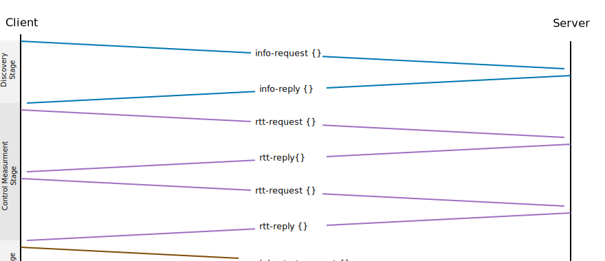
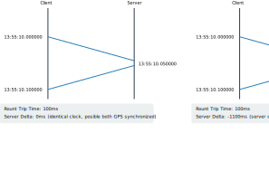

# Control Protocol

## Basics

Each server - started with argument `remote` listening on a TCP _and_ UDP port
for incoming control messages. The control protocol is fully optional, each
operation must be possible without a control protocol, though the program
arguments must be set manually and the result set must be merged manually by
using USB stick or some other transfer method.

The default control port is **64321**

The *secret* MUST be supported by every message.

The server MUST response to each message - unique identified by the sequence
number - exactly once. The server MUST not response multiple times to one
sequence number.

> To increase robustness for lossy links the client may send several requests
> with increasing sequence number.

## Unicast

For Unicast measurments the control protocol SHOULD use TCP - even if the
measurement protocol is UDP. If exact round trip time measurements are required,
the TCP timeouts has negative impact or if UDP has other advantages compared to
TCP, UDP can be used as the control protocol. Though, packet loss, reordering
must be handled by the control plane.

## Multicast

If a remote server receives a UDP multicast request, the reply must be a UDP
unicast.  The unicast reply must address the sending IPv{4,6} address.

## Reply Requirements & Behavior

A server **MUST** not answer to a client request. The behavior is not standardized
and open to implementers. Servers can use message type 255 to signal an generic
error condition.

Several possibilities why a server do now answer:

- do not implement the ctrl protocol itself (remember, ctrl protocol is optional)
- the server is bussy under a other measurement and has no cpu time left to answer
  another ctrl request. 

A server **SHOULD** answer with a ctrl message if something is broken or an ongoing
measurement is active.

> There is explicetly no hard requirement that a ongoing measurement blocks other
> measurement attempts. Implementations are free to implement from allowing parallel measurements
> to only one measurment with a negative warning/error message signaled back to
> the requester.

A implementation may lock a measurement between `module-start` and `module-stop`
sequence. Between these the real measurement take place. Control measurements
may not be locked in any way to reduce contention.

Clients should implement a backoff for `module-start` requests to prevent storms.

## Discovery Process and Dual Hosts Handling


## Binary Encoded Header

The standard control protocol header is componsed of the following elements
for **all** protocol headers:


- 2 byte, `uint16_t`, unsigned, network byte order encoded **type**
- 2 byte, n**reserved**
- 4 byte, `uint32_t`, unsigned, network byte order encoded packet **length**

> The reserved field can be used later to signal LZMA compressed payload
> or for enrypted control 


### Protocol Requirements

The very first four bytes of a packet must encode the control protocol type.
The type has an associated encoding format (i.e. JSON). But this can be
different.

### Protocol Types

In `uint32_t`, network byte order, starting with 1, 0 is intentionally left
blank:

- `1`: rtt request
- `2`: rtt reply
- `3`: info request
- `4`: info reply
- `5`: module start request
- `6`: module start reply
- `7`: module stop request
- `8`: module stop reply
- `255`: warning and error message


## Messages




### RTT Messages

The first 4 bytes of the payload contains a network byte order encoded length of
the payload len, not including this "header".

The first RTT message CAN be ignored to bypass measurement jitter because of unwarmed
caches, arp/nd setup, xinitd init sequences and other effects.

The client can use RTT message several times to increase the precicion of
measurements.

#### RTT Request

```
{
  # to identify the sender uniquely a identifier must be transmited.
  # The id consits of two parts:
  # - a human usabkle part, like hostname or ip address if no hostname
  #   is available.
  # - a uuid to guarantee a unique name
  # Both parts are divided by "=", if the character "=" is in the human
  # part it must be replaced by something else.
  # The id is stable for process lifetime. It is ok when the uuid is 
  # re-generated at program start
  "id" : "hostname=uuid",

  # a sender may send several request in a row. To address the right one
  # the reply host will send back the sequence number.
  #
  # A receiver MUST answer to one equest exactly once.
  #
  # Sequence numbers are message specific. For example: info request message
  # numbers start with 0, later module-start-request first packet also has
  # sequence number 0.
  #
  # The sequence number should start with 0 for the first generated packet
  # but can start randomly too. The sequence number MUST be incremented at
  # at each transmission. In the case of an overflow the next sequence numner
  # MUST be 0. Strict unsigned integer arithmetic.
  # The value must be converted to string, this is required to align all
  # json encoding to string values everywhere. "seq" : "1" not "seq" : 1
  "seq" : <uint64_t>

  # The timestamp is replied untouched by the server. The timestamp can
  # be used by the client to calculate the round trip time.
  # The timestamp in maparo format with nanoseconds, optional
  # In UTC
  # format example: 2017-05-14T23:55:00.123456789Z
  "ts" : "<TS>"

  # to fill the data packet the client can use the padding field to inject
  # arbitrary data into the packet.
  #
  # The field is optional
  #
	# If not otherwise specific the padding data SHOULD be replied
  "padding" : <string>
 
  # if server requires a string the string is required.
  "secret" : <string>
}
```


#### RTT Reply

The reply host CAN implement a ratelimiting component.

The reply host MUST transfer the data back to the sender as fast as possible.

The server is free to ignore payloads larger as MTU sized packets bytes.

### Info Message


#### Info Request

| Field Name  | Required |
| ----------- | -------- |
| `id` | yes |
| `seq` | yes |
| `ts` | no (optional) |

Generated from client, sent to TCP unicast address or UDP multicast
address if it is a multicast module or unicast if UDP unicast analysis.

```
{
  # to identify the sender uniquely a identifier must be transmited.
  # The id consits of two parts:
  # - a human usabkle part, like hostname or ip address if no hostname
  #   is available.
  # - a uuid to guarantee a unique name
  # Both parts are divided by "=", if the character "=" is in the human
  # part it must be replaced by something else.
  # The id is stable for process lifetime. It is ok when the uuid is 
  # re-generated at program start
  "id" : "hostname=uuid",

  # a sender may send several request in a row. To address the right one
  # the reply host will send back the sequence number.
  #
  # A receiver MUST answer to one equest exactly once.
  #
  # Sequence numbers are message specific. For example: info request message
  # numbers start with 0, later module-start-request first packet also has
  # sequence number 0.
  #
  # The sequence number should start with 0 for the first generated packet
  # but can start randomly too. The sequence number MUST be incremented at
  # at each transmission. In the case of an overflow the next sequence numner
  # MUST be 0. Strict unsigned integer arithmetic.
  # The value must be converted to string, this is required to align all
  # json encoding to string values everywhere. "seq" : "1" not "seq" : 1
  "seq" : <uint64_t>

  # The timestamp is replied untouched by the server. The timestamp can
  # be used by the client to calculate the round trip time.
  # The timestamp in maparo format with nanoseconds, optional
  # In UTC
  # format example: 2017-05-14T23:55:00.123456789Z
  "ts" : "<TS>"

  # to implement a trivial access mechanism a secret can be given.
  # if the server do not accept the string the request is dropped
  # and a warning should be printed at server side that the secret
  # do not match the expections.
  # If the server has no configured secret but the client sent a
  # secret, then the server SHOULD accept the request.
  "secret" : <string>
}
```


#### Info Reply

| Field Name  | Required |
| ----------- | -------- |
| `id` | yes |

Generated from server, sent to TCP unicast address or UDP unicast
address. The address is the sender ip address.

Info messages should be replied as fast a possible. This is required to calculate
a clean round trip time. The info client SHOULD calculate as much as possible values
before the reception of info-request messages. I.e. the id can be calculated at
program start for example.

```
{
  # The Id identify the reply node uniquely. The id is generated in indentical
  # way as the info-request id.
  "id" : "hostname=uuid",

  # the RePlied sequence number from the sender
  "seq-rp" : <uint64_t>

  # the RePlied sequence number from the sender - if available. If not
  # nothing MUST be replied.
  "ts-rp" : "<TS>"

  # the timestamp in standard maparo format (also UTC). The
  # timestamp can be used to check (simplified) the time delta between
  # client and server. The client can warn the user if the times are not
  # synchronized or use the method to synchronize the time with the client
  # e.g. saving the calculated offset (neglect rtt and processing delays).
  # The first check if the replied timestamp is between the client info-request
  # sending timestamp and the client info-reply receive timestamp.
  "ts" : "<TS>"

  # list of supported modules, the entries must point to empty dictionaries
  # for now. Later the empty dictionaries can be filled if additional
  # information is required.
  "modules" : {
     "udp-goodput" : { },
     "tcp-goodput" : { },
  }

  # Valid values:
  # - amd64
  # - 386
  # - arm
  # - arm64
  # - ppc64le
  # - s390x
  # - unknown
  "arch" : <ARCH>

  # valid values:
  # - linux
  # - windows
  # - freebsd
  # - osx
  # - android
  # - ios
  # - unknown
  "os" : <OS>

  # The server can reply a string where server specific information
  # can be held. Like banner information or implementation name.
  # The client SHOULD print this information to the user.
  # The info string MUST not larger as 32 bytes
  "info" : <string>
}
```

##### Time Offset Calculation and Visualization




### Module Start

Used to start module on server.

The module-start message is self-contained. All server actions depends on this
message and are stateless. There is no need for the server to store information
from previous rtt-request, info-request or any other messages. This behavior
is intended.

#### Module Start Request
```
{
  # The Id identify the reply node uniquely. The id is generated in indentical
  # way as the info-request id.
  "id" : "hostname=uuid",

  # a sequence to identify the answer. For UDP within a high loss environment
  # the client may send several requests. The server SHOULD never reply twice
  # or even more.
  "seq" : <uint64_t>

  # to implement a trivial access mechanism a secret can be given.
  # if the server do not accept the string the request is dropped
  # and a warning should be printed at server side that the secret
  # do not match the expections.
  # If the server has no configured secret but the client sent a
  # secret, then the server SHOULD accept the request.
  "secret" : <string>

  #
  module = {
    "name" : <module-name>
    # the config for the module
		"configuration" : {
    }
  }
}
```

#### Module Start Reply

A server MUST answer to a start-request with a start-reply *after* all systems
are started and ready to serve the client. A server MUST NOT start the subsystems
afterwards.

Background:

- if the server proactively answers with a reply and the ports are not started and
  the client send immediately a message the message will be lost. So everything
  must be setup before the reply message is transmitted to the client
- if at server side something fail, the server can send the error back to the
  client and inform the client. This is not possible if the answer is send
  immediately.

If the server do not receive any packets within a predefined duration the server
SHOULD assume that the client crashes and SHOULD restart to a sane state so that
other clients are able to connect and use the service.

> This can be implemented by spanning a timer and if within n minutes no packages
> arrived the server should cancel the state and switch to the initial state.


```
{
  # The Id identify the reply node uniquely. The id is generated in indentical
  # way as the info-request id.
  "id" : "hostname=uuid",

  # the status of the previous request, can be (lowercase)
  # - "ok"
  # - "busy" if another measurement is ongoing and no capacity is available to
  #          start a new measurement. The client CAN automatically (backoff) come
  #          back to request a new module-start measurment.
  # - "warn" if start was sucessfull BUT there not all parameter can be fullfilled
  #          then warn can be used to signal such a condition
  # - "failed"
  "status" : <status>

  # a human readable error message WHY it failed. Can be
  # missing. If status is != ok the message SHOULD be set.
  "message" : <string>

  "seq-rp" : <uint64_t>
}
```

### Module Stop

#### Module Stop Request

The module stop-request must be from the identical start-request sender. The
source IP doesn't matter. The id is important. The server MUST ignore packages
from other hosts sending a stop-request message. The server SHOULD print a warning
message on the console.

The server SHOULD implement a guard time after which the server should accept a
new module-start sequence.


```
{
}
```

#### Module Stop Reply

```
{
}
```
